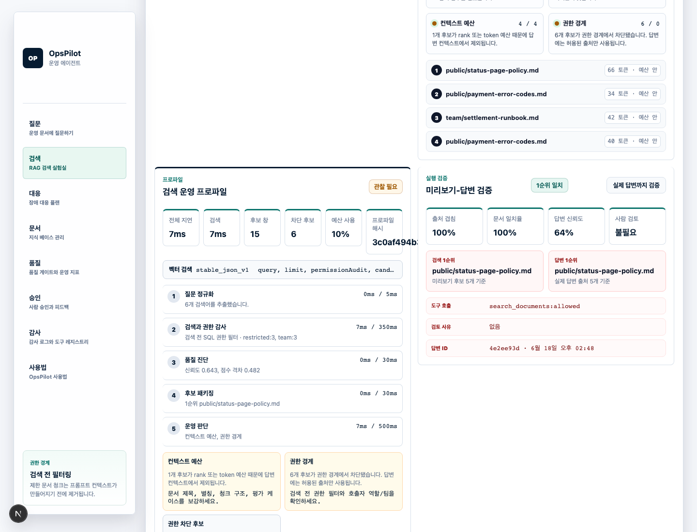
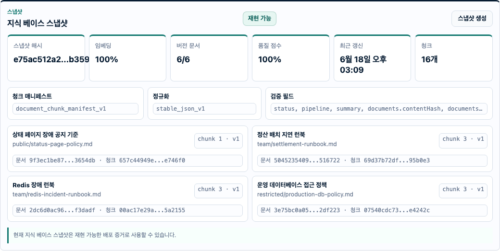
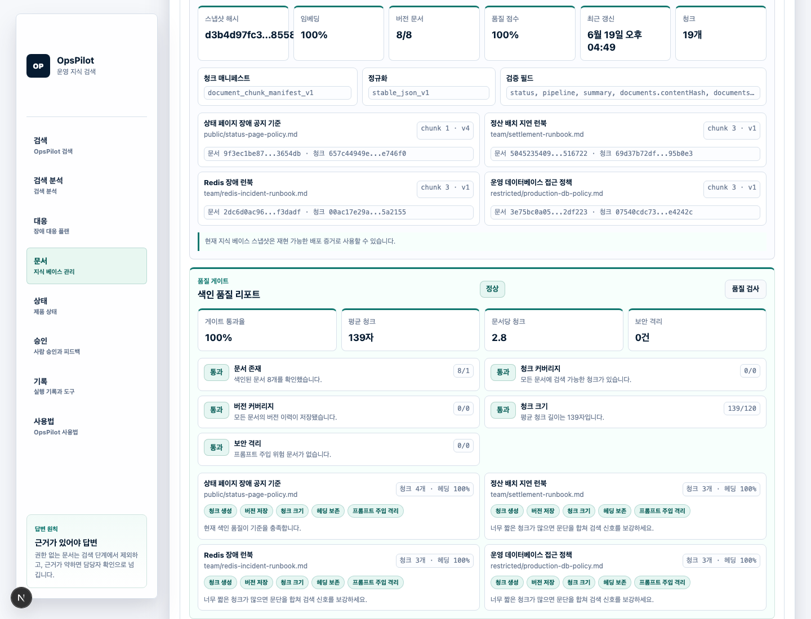
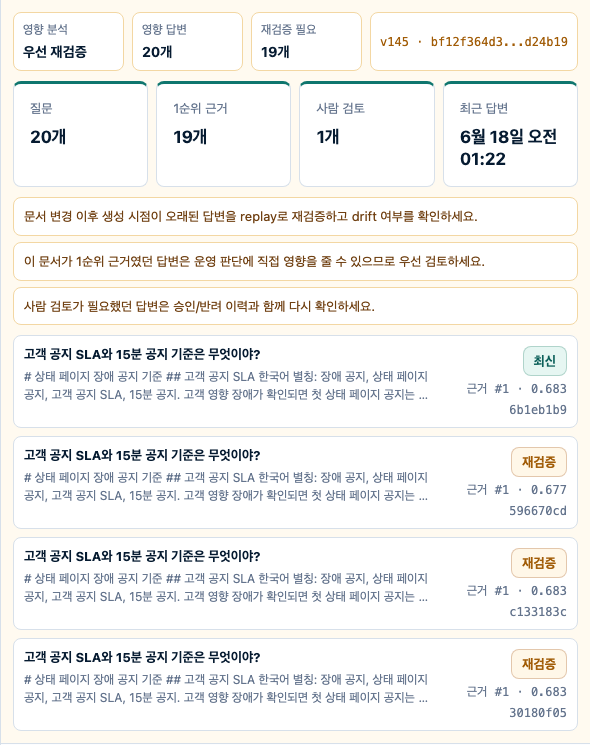
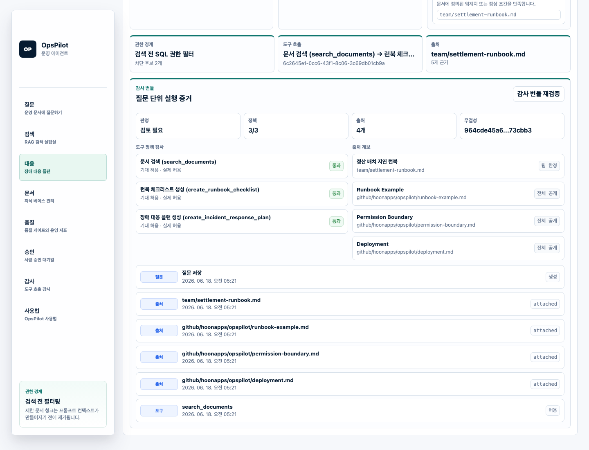
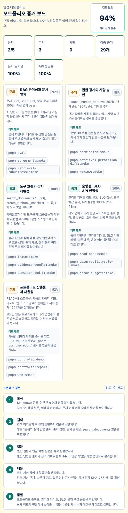
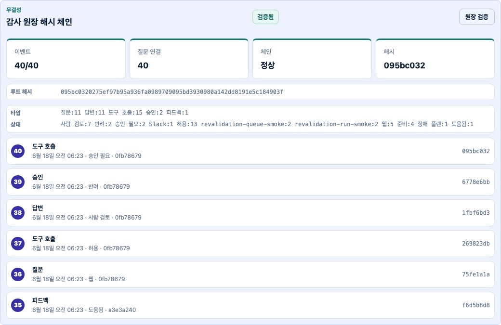
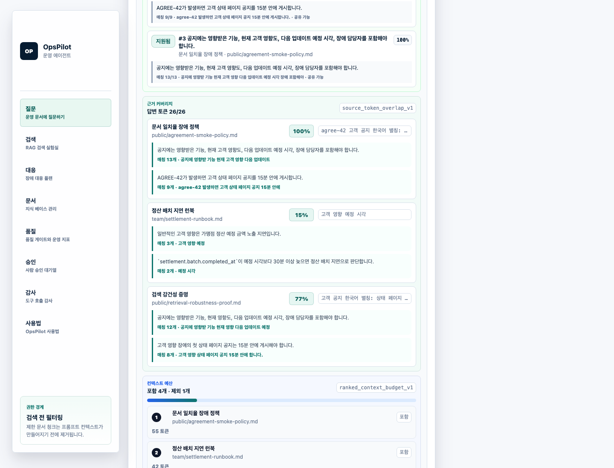
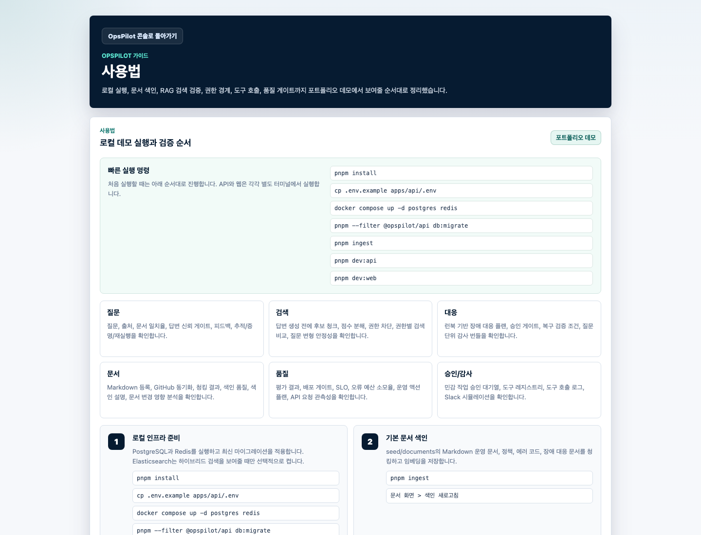

# OpsPilot

[](https://github.com/hoonapps/opspilot/actions/workflows/ci.yml)

운영 문서, 런북, 장애 대응 정책, Slack 질문을 기반으로 답변하는 권한 인식 RAG 에이전트 플랫폼입니다. OpsPilot은 단순 문서 검색 데모가 아니라 “실제 운영 업무에 AI 에이전트를 붙이면 어디까지 검증해야 하는가”를 보여주기 위한 포트폴리오 프로젝트입니다.




















## 핵심 가치

OpsPilot은 다음 질문에 답하는 구조로 설계했습니다.

- RAG 답변이 실제 문서 출처와 연결되는가?
- 새로운 Markdown 문서를 넣으면 청킹, 임베딩, 색인, 검색, 답변까지 즉시 검증되는가?
- 현재 지식 베이스가 어떤 문서/청크/버전/해시 조합으로 만들어졌는지 재현 가능하게 증명할 수 있는가?
- 문서 권한 경계가 LLM 프롬프트 생성 전에 적용되는가?
- Slack 질문도 API와 같은 RAG/도구 호출 경로를 타는가?
- 에이전트가 어떤 도구를 호출했고, 어떤 호출은 사람 승인이 필요한지 감사할 수 있는가?
- 개별 답변이 질문, 근거 문서, 도구 호출, 승인, 피드백과 어떤 계보로 연결되는지 설명할 수 있는가?
- 답변이 없는 장애 플랜도 질문 단위로 권한 경계, 출처 계보, 도구 호출 정책을 증명할 수 있는가?
- 답변과 근거 문서의 일치율, 출처 적중률, 인용 정확도를 평가할 수 있는가?
- 이전 답변이 문서 변경 이후에도 여전히 유효한지 답변 변경 감지로 확인할 수 있는가?
- 프롬프트 주입, 시크릿 유출, 과도한 `/ask` 호출 같은 운영 리스크를 막는 가드레일이 있는가?

## 현재 구현 범위

기능별 상세 설명은 [기능 명세](docs/features.md)에 따로 정리했습니다. 포트폴리오 면접에서는 “문서 수집 → 청킹/임베딩 → 권한 인식 검색 → 근거 기반 답변 → 도구 호출/승인 → 평가” 흐름으로 설명하면 됩니다.

- NestJS + TypeScript API
- PostgreSQL + pgvector 기반 권한 인식 RAG 검색
- Redis + BullMQ 기반 비동기 문서 색인
- BullMQ 색인 큐 관제 API와 웹 패널
- 선택형 Elasticsearch 하이브리드 검색
- Markdown 문서 업로드, 버전 이력, 변경 차이, 청크 미리보기
- URL, txt, PDF, Word docx 입력을 표준 Markdown으로 변환해 저장/청킹/임베딩/검색 연결
- 수집 품질 진단: 새 문서의 텍스트 추출 길이, 청크 생성, 헤딩 신호, 검색 힌트, 보안 스캔, 추천 테스트 질문을 즉시 판정
- 수집 추적 정보: 원본 URL/파일명, content type, 파서, 추출 해시, 저장 content hash, 청크 수, URL 보안 가드 상태를 응답과 웹 화면에 표시
- 개별 문서 삭제, 문서 초기화, seed 문서 재적재: 테스트 문서와 운영 문서 단위 관리
- 색인 스냅샷: 전체 문서/청크/버전/임베딩/보안 메타데이터를 SHA-256 매니페스트로 증명
- 색인 품질 리포트: 문서 수, 청크 커버리지, 버전 커버리지, 헤딩 보존, 보안 격리 게이트
- 문서 색인 설명: 특정 문서의 청킹 전략, 임베딩 커버리지, 헤딩 아웃라인, 검색 힌트, 버전 변경 차이 확인
- 문서 변경 영향 분석: 특정 문서를 근거로 사용한 과거 답변, 오래된 답변, 1순위 근거 여부, 재검증 권고
- 문서 재검증 큐: 변경된 문서 때문에 오래된 과거 답변을 전역 큐로 모아 위험도, 우선순위, replay/lineage/quality gate 링크 제공
- 문서 재검증 실행 이력: 큐 항목을 replay, 품질 게이트, 계보 그래프로 즉시 재검사하고 종료/재검토/차단 판정, 실행 해시, 최근 이력 제공
- GitHub Markdown 문서 동기화
- `/ask` API와 출처 포함 답변
- 환각 방지 답변 정책: 접근 가능한 출처가 없거나 검색 신뢰도가 최소 근거 기준보다 낮으면 내용을 꾸며내지 않고 “문서에서 확인할 수 없습니다”로 응답
- 검색 품질 진단, 실행 계획, 점수 격차, 출처 다양성, 컨텍스트 예산 미리보기
- 검색 운영 프로파일: 단계별 latency budget, 권한 감사, 컨텍스트 예산, 프로파일 해시, 병목 액션
- 검색 강건성 리포트: 질문 변형별 1순위 출처 안정성, 출처 겹침, 점수 흔들림, 권한 경계 재검사
- 권한별 검색 비교: 공개 사용자, 지원 담당자, 결제 온콜, 운영 관리자 권한별 1순위 출처, 차단 후보, 새로 보이는 문서 비교
- 평가 회귀 리포트: 최신 평가와 직전 평가를 비교해 메트릭 하락, 실패 게이트, 고위험 케이스, 릴리즈 판단, 리포트 해시 제공
- 평가 문서 커버리지: 최신 평가가 어떤 문서를 기대/실제 출처로 검증했는지, 미검증 문서와 추가 질문 액션을 리포트 해시와 함께 제공
- 런북 기반 장애 대응 플랜: 심각도, 단계별 조치, 사람 승인 경계, 커뮤니케이션, 복구 검증
- 답변별 문서 일치율, 출처 근거 커버리지, 근거 스니펫 매핑, 증명 패킷
- 문장별 근거 검증: 답변 claim을 문장 단위로 분해하고 출처 스니펫 지지 점수, 미지원 문장, SHA-256 리포트 해시 제공
- 답변 추적/증명/재실행/증거 번들/계보 그래프 API
- 답변 신뢰 게이트: 증명 패킷, 재실행 안정성, 승인 상태, 피드백, 권한 재검사를 묶어 공유 가능/검토 필요/차단 판정
- 질문 단위 감사 번들 API: 답변 없는 장애 대응 작업 흐름의 도구 호출, 권한 재검사, 출처 계보, SHA-256 해시 검증
- 역할/팀 기반 문서 권한 필터링과 권한 경계 매트릭스
- 프롬프트 주입 문서 격리
- 시크릿 마스킹
- 호출자 단위 `/ask` 호출 제한
- 호출자 범위 기반 `/ask` 멱등성 키
- 런북 체크리스트 도구 호출
- 민감 작업 사람 승인 분리
- 도구 레지스트리와 도구 호출 감사 로그
- Slack Events API와 로컬 Slack mention 시뮬레이터
- 평가 게이트, 최신성 게이트, 배포 게이트, SLO 가드레일, 오류 예산 소모율
- 운영 액션 플랜: 배포 게이트/SLO 결과를 담당자, 우선순위, 조치, 검증 명령으로 변환
- 포트폴리오 준비도 API: RAG 근거성, 권한 경계, 도구 호출 감사, 운영성, 데모 산출물 집계
- 감사 원장 해시 체인: 질문, 답변, 도구 호출, 승인, 피드백 이벤트의 SHA-256 루트 해시 검증
- API 요청 로그, 엔드포인트별 p95 지연, 오류율 관측성
- 한국어 Next.js 웹 콘솔
- Docker Compose 로컬/프로덕션 데모
- GitHub Actions CI 전체 검증

## 기술 스택

- 백엔드: NestJS, TypeScript
- ORM: MikroORM
- 데이터베이스: PostgreSQL + pgvector
- 큐/캐시: Redis, BullMQ
- 검색: pgvector 기본, Elasticsearch 선택형 하이브리드 검색, BM25/key-token 리랭킹
- AI: 로컬 결정론적 임베딩/답변 기본값, OpenAI embedding/chat 연결 경로, 로컬 Transformers embedding provider, Anthropic chat 어댑터, 임베딩/리랭킹 평가 리포트
- 연동: Slack 봇
- 웹: Next.js
- 인프라: Docker Compose

## 빠른 시작

```bash
pnpm install
cp .env.example apps/api/.env
docker compose up -d postgres redis
pnpm --filter @opspilot/api db:migrate
pnpm ingest
pnpm dev:api
```

다른 터미널에서 웹 콘솔을 실행합니다.

```bash
pnpm dev:web
```

웹 콘솔:

```txt
http://localhost:3001
```

API 문서:

```txt
http://localhost:3000/docs
```

## 사용법

자세한 로컬 실행 순서와 데모 시나리오는 [docs/usage.md](docs/usage.md)에 정리했습니다.

웹 콘솔에서도 `사용법` 화면을 열면 다음 흐름을 그대로 따라 할 수 있습니다. 실행 중인 웹 콘솔에서는 `http://localhost:3001/usage`로 독립 사용법 페이지를 바로 열 수 있습니다.

1. PostgreSQL/Redis 실행
2. DB 마이그레이션
3. 기본 Markdown 문서 색인
4. 새 Markdown 문서 등록
5. 청킹/검색 미리보기/답변 일치율 확인
6. 후보별 랭킹 설명과 권한 경계 확인
7. 장애 대응 플랜의 승인 경계와 복구 검증 확인
8. 도구 호출과 사람 승인 확인
9. 평가/배포 게이트 확인
10. 포트폴리오 데모 리포트 생성

## API 예시

질문하기:

```bash
curl -X POST http://localhost:3000/ask \
  -H "content-type: application/json" \
  -H "x-team-slugs: payments" \
  -H "x-user-roles: ops_admin" \
  -d '{"question":"E102 에러가 발생하면 어떻게 대응해야 해?"}'
```

검색 미리보기:

```bash
curl -X POST http://localhost:3000/retrieval/preview \
  -H "content-type: application/json" \
  -H "x-team-slugs: payments" \
  -d '{"question":"정산 배치가 30분 이상 지연되면 어떻게 해?","limit":5}'
```

응답의 각 후보에는 `rankingExplanation`이 포함됩니다. 이 필드는 매칭 검색어, 벡터/키워드 점수 기여도, 권한 통과 사유를 보여줘 “왜 이 청크가 상위 근거가 됐는지”를 설명합니다.

장애 대응 플랜:

```bash
curl -X POST http://localhost:3000/incidents/plan \
  -H "content-type: application/json" \
  -H "x-team-slugs: payments" \
  -d '{"incident":"정산 배치가 30분 이상 지연되고 settlement.dlq.count가 120이면 어떻게 대응해야 해?","limit":5}'
```

Slack 멘션 로컬 시뮬레이션:

```bash
pnpm slack:simulate
```

## 문서 관리 방식

문서는 다섯 경로로 관리합니다.

- 로컬 seed 문서: `seed/documents`
- 웹 콘솔에서 추가하는 Markdown: `문서` 화면의 Markdown 등록 폼
- 웹 콘솔에서 추가하는 URL/txt/PDF/Word: `문서` 화면의 빠른 시작 폼
- API로 직접 넣는 문서 소스: `POST /documents/source`
- GitHub 문서: `문서` 화면의 GitHub Markdown 동기화 폼

등록된 문서는 다음 과정을 거칩니다.

1. URL/파일/텍스트 소스 수신
2. 입력 타입별 텍스트 추출
3. 표준 Markdown + 프론트매터 변환
4. 시크릿 마스킹
5. 프롬프트 주입 검사
6. Markdown 청킹
7. 임베딩 생성
8. PostgreSQL/pgvector 저장
9. 선택적으로 Elasticsearch 미러 저장
10. 기존 같은 경로 문서의 오래된 청크 정리

문서 화면은 빠른 문서 등록, 파일/URL 수집, 수집 품질 진단, 개별 문서 삭제, 문서 초기화, seed 복구, 문서 목록, 원본 타입/URL/파일명, 청크 수, 마스킹 수, 프롬프트 주입 격리 여부, 색인 스냅샷, 색인 품질 리포트, 문서별 색인 설명, 버전 변경 차이, 청크 미리보기, BullMQ 색인 큐 상태, 권한 매트릭스, 신규 문서 검색 검증 결과, 검증 판정 이유와 답변 미리보기를 보여줍니다.

문서를 완전히 비우고 새 테스트만 하고 싶으면 웹 콘솔의 `문서 초기화`를 누르거나 API `POST /documents/reset`을 호출합니다. 다시 샘플 지식을 복구하려면 `Seed 다시 넣기` 또는 `POST /documents/reset`에 `{ "reloadSeed": true }`를 전달합니다.

특정 문서 하나만 제거하려면 문서 상세의 `삭제`를 누르거나 API `DELETE /documents/{id}`를 호출합니다. 삭제 시 문서 본문, 청크, 버전, 답변 출처 연결, 재검증 실행 이력, Elasticsearch 미러 청크를 함께 정리하고, 그 문서를 근거로 사용했던 과거 답변 수와 재검증 권고를 반환합니다.

`POST /documents/source` 응답의 `quality`는 `opspilot.source_ingestion_quality.v1` 스키마입니다. 추출 텍스트가 너무 짧거나, 청크가 지나치게 작거나, 검색 힌트가 부족하거나, 프롬프트 주입 위험이 있으면 `attention`으로 표시하고 개선 권고를 함께 반환합니다. 또한 제목과 검색 힌트 기반 추천 테스트 질문을 만들어 새 문서를 넣은 직후 무엇을 물어볼지 안내합니다. 데모에서는 “PDF/Word/URL을 넣는 것에서 끝나지 않고 검색 가능한 문서인지, 어떤 질문으로 검증할지까지 바로 제안한다”고 설명할 수 있습니다.

같은 응답의 `provenance`는 `opspilot.source_ingestion_provenance.v1` 스키마입니다. 원본 URL/파일명, 최종 URL, content type, 원본 바이트 크기, 추출 텍스트 해시, 저장 content hash, 청크 수, URL 보안 가드 상태를 포함하므로 “어떤 자료가 어떤 파서와 해시로 지식 베이스에 들어갔는지”를 API와 웹 화면에서 설명할 수 있습니다. parser, content type, 추출 해시, 최종 URL, URL 가드는 문서 metadata에도 저장되어 문서 목록/상세 화면에서 나중에 다시 확인할 수 있습니다.

URL 수집은 SSRF 방지를 위해 기본적으로 localhost/private/link-local/multicast 주소와 내부망 redirect를 차단합니다. 로컬 fixture 테스트처럼 내부 URL이 필요한 경우에만 `SOURCE_INGESTION_ALLOW_PRIVATE_URLS=true`를 명시적으로 설정합니다.

## RAG 검증

OpsPilot은 답변만 보여주지 않고, 아래 증거를 함께 보여줍니다.

- 검색된 출처 경로
- 벡터/키워드/종합 점수
- 검색 실행 계획: 질문 정규화, 후보 생성, 권한 경계, 점수 결합, 컨텍스트 패키징, 리뷰 판단
- 검색 운영 프로파일: 검색/진단/후보 패키징 단계별 지연, latency budget, 프로파일 해시, 병목 액션
- 검색 신뢰도 추정, 점수 격차, 리뷰 권고
- 검색 강건성: 같은 의도를 다른 표현으로 물었을 때 1순위 출처와 후보 집합이 유지되는지 검증
- 권한별 검색 비교: 같은 질문이 호출자 권한에 따라 어떤 출처 차이를 만드는지 검증
- 문서 일치율
- 출처 근거 커버리지
- 색인 스냅샷: `document_chunk_manifest_v1` 기준 스냅샷 해시, 문서별 content hash, chunk set hash
- 색인 품질 게이트: 문서 존재, 청크 커버리지, 버전 커버리지, 청크 크기, 보안 격리
- 문서 색인 설명: 청킹/임베딩/헤딩/버전/보안 메타데이터를 문서 단위로 설명
- 문서 변경 영향 분석: 특정 문서 변경이 과거 답변과 운영 판단에 미치는 영향
- BullMQ 색인 큐 카운트와 최근 작업 상태
- 컨텍스트 예산에 포함/제외된 청크
- 권한으로 차단된 후보 수
- 도구 호출 기록
- 사람 승인 여부
- 답변 증명 패킷
- 답변 변경 감지 결과
- 권한 재검사와 SHA-256 해시가 포함된 답변 증거 번들
- 답변 계보 그래프: 질문, 답변, 출처, 도구 호출, 승인, 피드백, 신뢰 게이트를 노드/엣지로 연결하고 SHA-256 해시로 무결성 검증
- 답변 신뢰 게이트: 개별 답변을 운영 채널에 공유해도 되는지 통과/검토/차단으로 판정
- 질문 단위 감사 번들: 장애 플랜의 도구 호출 정책 통과 여부, 출처 계보, 권한 재검사
- Slack 재시도와 브라우저 중복 제출을 막는 `/ask` 멱등성

답변 생성기는 접근 가능한 출처가 없거나 검색 신뢰도가 `UNSUPPORTED_ANSWER_CONFIDENCE_THRESHOLD`보다 낮으면 답변을 만들지 않습니다. `CONFIDENCE_THRESHOLD`는 답변을 막는 기준이 아니라 사람 검토로 올리는 기준입니다. 모름 처리의 경우 응답 본문에 `문서에서 확인할 수 없습니다`가 포함되고, `needsHumanReview=true`와 검토 사유가 함께 저장됩니다. 문서에 없는 내용을 그럴듯하게 보완하는 방식은 의도적으로 차단합니다.
- HTTP API 요청 성공률, p95 지연, 엔드포인트별 오류율

주요 검증 명령:

```bash
pnpm eval
pnpm eval:regression-smoke
pnpm eval:coverage-smoke
pnpm retrieval-eval:smoke
pnpm rerank-challenge:smoke
pnpm openai-embedding-path:smoke
pnpm embedding-eval:smoke
pnpm embedding-hard:smoke
pnpm transformers-embedding:smoke
pnpm indexing:smoke
pnpm source-ingestion:smoke
pnpm retrieval-profile:smoke
pnpm retrieval-robustness:smoke
pnpm retrieval-permission-diff:smoke
pnpm index-explain:smoke
pnpm index-snapshot:smoke
pnpm index-quality:smoke
pnpm document-impact:smoke
pnpm document-delete:smoke
pnpm revalidation-queue:smoke
pnpm revalidation-run:smoke
pnpm incident-plan:smoke
pnpm agreement:smoke
pnpm trace:smoke
pnpm claim-support:smoke
pnpm replay:smoke
pnpm evidence-bundle:smoke
pnpm lineage:smoke
pnpm quality-gate:smoke
pnpm question-audit:smoke
pnpm audit-ledger:smoke
pnpm error-budget:smoke
pnpm permission:smoke
pnpm prompt-injection:smoke
pnpm rate-limit:smoke
pnpm idempotency:smoke
```

`pnpm source-ingestion:smoke`는 URL/txt/PDF/Word docx 수집, 각 형식의 파서 선택, 새 문서 검색, 문서 외 질문 거절, reset/seed 복구뿐 아니라 수집 품질 리포트가 좋은 문서는 `ready`, 짧은 문서는 `attention`으로 갈리는지와 추천 테스트 질문이 생성되는지도 검증합니다.

## 포트폴리오 데모

브라우저 없이 핵심 시나리오를 한 번에 검증합니다.

```bash
pnpm portfolio:demo
```

Markdown 증거 리포트를 생성합니다.

```bash
pnpm portfolio-readiness:smoke
pnpm portfolio:report
```

생성 결과는 [docs/demo-report.md](docs/demo-report.md)에 저장됩니다. 포트폴리오 준비도는 `GET /observability/portfolio-readiness`와 품질 화면의 `포트폴리오 증거 보드`에서 확인합니다. 이 리포트는 근거 기반 RAG, 신규 문서 색인, 런북 도구 호출, 사람 승인, 답변 추적 복원을 한 번에 보여줍니다.

웹 콘솔까지 검증하고 README 스크린샷을 갱신합니다.

```bash
pnpm web:smoke
```

## Elasticsearch

Elasticsearch는 필수가 아니라 선택형입니다. 기본 RAG 경로는 PostgreSQL + pgvector로 동작합니다.

Elasticsearch 하이브리드 검색을 로컬에서 켜려면:

```bash
docker compose --profile search up -d
ENABLE_ELASTICSEARCH=true RETRIEVAL_MODE=hybrid pnpm ingest
ENABLE_ELASTICSEARCH=true RETRIEVAL_MODE=hybrid pnpm dev:api
```

하이브리드 검색과 권한 재검사를 CLI로 검증하려면:

```bash
docker compose --profile search up -d
pnpm elasticsearch:smoke
```

로컬 포트:

- PostgreSQL: `localhost:25432`
- Redis: `localhost:26379`
- Elasticsearch: `localhost:29200`

Elasticsearch 결과는 권한의 기준으로 신뢰하지 않습니다. 하이브리드 모드에서도 Elasticsearch가 반환한 청크 ID를 PostgreSQL에서 다시 로드하고, 같은 권한 필터를 통과한 청크만 답변 컨텍스트에 들어갑니다.

`pnpm elasticsearch:smoke`는 공개 문서와 제한 문서를 Elasticsearch에 미러 색인한 뒤, 공개 사용자는 제한 문서를 보지 못하고 운영 관리자는 볼 수 있으며 검색 계획이 `hybrid`, 권한 집행이 `postgres_recheck_after_elasticsearch`로 기록되는지 확인합니다.

## 보안 경계

- `public`: 모든 사용자 접근 가능
- `team`: 문서의 `teamSlug`와 사용자 `teamSlugs`가 맞을 때 접근 가능
- `restricted`: `ops_admin` 또는 `security_admin`만 접근 가능

권한 필터는 검색/프롬프트 생성 전에 적용됩니다. 접근 불가능한 청크는 답변, 출처, 추적 미리보기에 포함되지 않습니다.

민감 작업은 에이전트가 직접 실행하지 않습니다. 운영 DB 수정, 강제 환불, 권한 부여 같은 요청은 `request_human_approval` 도구 호출과 승인 기록으로 분리됩니다.

`POST /ask`는 `x-idempotency-key`를 지원합니다. 같은 호출자 범위에서 같은 키와 같은 요청 본문이 다시 들어오면 기존 `answerId`를 재사용하고, 같은 키로 다른 질문을 보내면 HTTP 409로 차단합니다. 재사용 요청은 호출 제한을 추가로 소모하지 않습니다.

## 품질 게이트

기본 평가 기준값:

```txt
EVAL_MIN_SOURCE_HIT_RATE=1
EVAL_MIN_TOP_SOURCE_ACCURACY=1
EVAL_MIN_HUMAN_REVIEW_ACCURACY=1
EVAL_MIN_DOCUMENT_AGREEMENT_SCORE=0.8
EVAL_MIN_CITATION_ACCURACY=1
EVAL_MIN_RETRIEVAL_RECALL_AT_3=1
EVAL_MIN_RETRIEVAL_MRR=0.8
```

`pnpm eval`은 기준값이 깨지면 실패합니다. `GET /evaluations/cases`와 `pnpm eval:cases-smoke`는 각 평가 케이스를 출처 적중, 1순위 출처, 사람 검토 경계, 문서 일치율, 인용 체크로 분해해 실패 원인과 개선 액션을 보여줍니다. `GET /evaluations/retrieval`과 `pnpm retrieval-eval:smoke`는 답변 생성 전 검색기 자체의 `recall@1/3/5`, `MRR`, `nDCG@5`, 첫 기대 문서 순위를 계산하고, 리랭킹 전 기준선과 `local_bm25_keytoken_v1` 적용 후 결과를 비교해 임베딩/랭킹 튜닝 근거를 제공합니다. `pnpm rerank-challenge:smoke`는 아카이브 문서가 기본 검색 1위로 잘못 올라오는 fixture에서 리랭커가 최신 runbook을 1위로 올리고 `recall@1`, `MRR` delta가 개선되는지 검증합니다. `pnpm openai-embedding-path:smoke`는 mock OpenAI embedding 응답을 사용해 `EMBEDDING_PROVIDER=openai`가 문서 색인, pgvector 저장, 질문 검색 경로까지 실제로 연결되는지 검증합니다. `GET /evaluations/embedding-comparison`과 `pnpm embedding-eval:smoke`는 같은 청크/질문셋을 local hash embedding과 OpenAI 또는 Transformers embedding으로 각각 인메모리 랭킹해 `recall@k`, `MRR`, `nDCG@5` 차이를 반환합니다. `pnpm embedding-hard:smoke`는 `seed/embedding-hard`의 paraphrase 문서/질문셋으로 local hash baseline이 약한 semantic 검색 케이스를 따로 검증합니다. 실제 모델 비교는 `EMBEDDING_CANDIDATE_PROVIDER=openai OPENAI_API_KEY=... pnpm embedding-hard:smoke` 또는 `EMBEDDING_CANDIDATE_PROVIDER=transformers pnpm embedding-hard:smoke`로 실행합니다. `RUN_TRANSFORMERS_EMBEDDING_SMOKE=true pnpm transformers-embedding:smoke`는 로컬 Transformers 모델을 실제로 내려받아 64차원 투영과 semantic similarity sanity check를 검증합니다. `GET /evaluations/regression`과 `pnpm eval:regression-smoke`는 최신 평가와 직전 평가를 비교해 메트릭 하락, 실패 게이트, 고위험 케이스, 릴리즈 판단, 리포트 해시를 반환합니다. `GET /evaluations/coverage`와 `pnpm eval:coverage-smoke`는 최신 평가가 전체 문서 중 어떤 문서를 기대/실제 출처로 검증했는지, 제한/팀 문서 커버리지와 미검증 문서 추가 질문 액션을 반환합니다. `GET /documents/index-snapshot`과 `pnpm index-snapshot:smoke`는 같은 색인 상태에서 스냅샷 해시가 안정적이고, 새 문서를 넣으면 문서/청크/버전 매니페스트 해시가 바뀌는지 검증합니다. `freshness:smoke`와 `release-gate:smoke`는 문서가 바뀐 뒤 최신 평가가 오래된 상태가 되는지, 재평가 후 게이트가 회복되는지 검증합니다. `GET /documents/revalidation-queue`와 `pnpm revalidation-queue:smoke`는 문서 변경 이후 오래된 답변을 우선순위 큐로 모아 replay, lineage, quality gate 재검증 경로가 잡히는지 확인합니다. `POST /documents/revalidation-runs`와 `pnpm revalidation-run:smoke`는 큐 항목 하나를 실제로 재검증해 현재 문서 기준 replay, 품질 게이트, 계보 무결성, 권한 재검사를 한 응답으로 묶고 종료/재검토/차단 판정, 리포트 해시, 최근 이력 저장을 검증합니다. `GET /documents/revalidation-runs`는 저장된 재검증 실행 이력을 조회합니다. `error-budget:smoke`는 API 5xx가 5분/1시간/24시간 오류 예산을 얼마나 소모하는지 계산하고, 오류 예산 소모율이 높으면 배포 동결 권고가 나오는지 검증합니다. `action-plan:smoke`는 배포 차단/검토 항목이 실제 담당자별 조치와 검증 명령으로 변환되는지 확인합니다.

개별 답변은 `GET /answers/{id}/quality-gate`로 별도 판정합니다. 이 게이트는 증명 패킷, 재실행 안정성, 승인 상태, 피드백 신호, 신뢰도, 문서 일치율, 근거 커버리지, 출처 겹침, 권한 재검사를 묶어 `pass`, `review`, `block`으로 결정합니다. 긍정 피드백이 없는 답변은 검토 대상으로 남고, 민감 작업 승인 대기 답변은 자동 공유되지 않습니다.

`GET /answers/{id}/claim-support`는 답변을 문장 단위 claim으로 나누고 각 문장이 어떤 출처 스니펫으로 지지되는지 점수화합니다. `pnpm claim-support:smoke`는 제한 문서 기반 답변에서 호출자 권한 재검사, 지원 claim, 근거 스니펫, SHA-256 해시가 함께 생성되는지 검증합니다.

`GET /answers/{id}/lineage`는 같은 답변을 그래프 형태로 다시 보여줍니다. 질문에서 답변이 생성되고, 어떤 출처가 답변을 지지했으며, 어떤 도구와 승인 요청이 신뢰 게이트에 영향을 줬는지 노드/엣지로 확인합니다. `pnpm lineage:smoke`는 민감 작업 질문에서 제한 출처, 도구 호출, 승인 대기, 피드백, SHA-256 무결성 해시가 모두 계보에 남는지 검증합니다.

## CI

GitHub Actions는 다음 범위를 검증합니다.

- 타입체크/빌드/테스트
- `@opspilot/rag` 청킹/문서 일치율 계약 테스트
- `@opspilot/shared` 해시/공통 타입 계약 테스트
- Docker 이미지 빌드
- 프로덕션 compose 스모크 테스트
- DB 마이그레이션
- RAG 평가
- 평가 이력/최신성/배포 게이트
- 권한 경계
- 서명된 호출자 토큰
- 시크릿 마스킹
- 프롬프트 주입 가드레일
- 호출자 호출 제한
- ask 멱등성
- 준비 상태
- 문서 일치율
- 색인/큐 색인/GitHub 동기화/문서 변경 영향 분석
- 검토 작업 흐름
- 답변 추적/증명/재실행
- 답변 증거 번들
- 포트폴리오 데모/리포트
- 관측성/SLO
- OpenAPI 계약
- Playwright 웹 스모크

자세한 내용은 [docs/ci.md](docs/ci.md)를 참고하세요.

## 주요 문서

- [기능 명세](docs/features.md)
- [사용법](docs/usage.md)
- [시스템 설계](docs/system-design.md)
- [에이전트 작업 흐름](docs/agent-workflow.md)
- [문서 색인](docs/indexing.md)
- [권한 경계](docs/permission-boundary.md)
- [보안](docs/security.md)
- [평가](docs/evaluation.md)
- [Slack 봇](docs/slack-bot.md)
- [API 계약](docs/api.md)
- [배포](docs/deployment.md)
- [디자인](docs/design.md)
