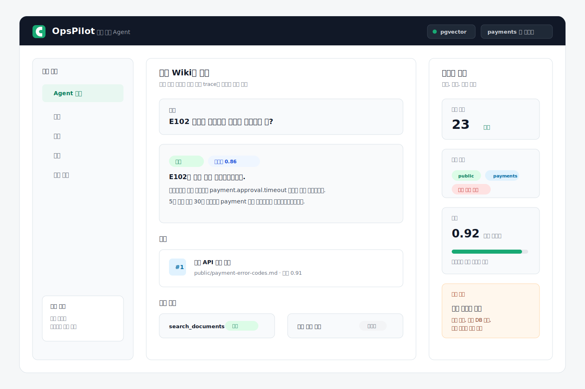
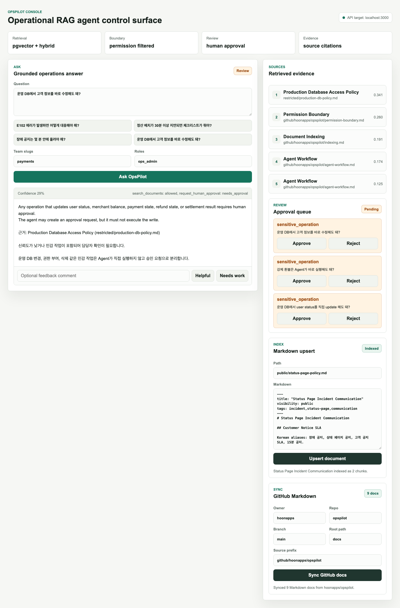

# OpsPilot

[](https://github.com/hoonapps/opspilot/actions/workflows/ci.yml)

Permission-aware RAG agent for operational knowledge, runbooks, and Slack support workflows.





OpsPilot is a portfolio-grade AI agent project focused on operational support. It answers questions from Markdown wiki documents, returns grounded sources, applies document-level permission boundaries before retrieval results reach the LLM layer, logs tool calls, and marks sensitive work for human approval.

## Why This Project Exists

Most RAG demos stop at document upload and answer generation. OpsPilot focuses on the production questions that matter for an AI operations agent:

- Can the agent answer with traceable document sources?
- Can restricted documents be excluded before prompt construction?
- Can sensitive operations be separated into human approval?
- Can new or changed documents be re-indexed and evaluated?
- Can retrieval quality be measured against expected source documents?

## Stack

- Backend: NestJS, TypeScript
- ORM: MikroORM, not Prisma
- Database: PostgreSQL with pgvector on `localhost:25432`
- Queue/cache: Redis and BullMQ indexing worker
- Search target: Elasticsearch optional local profile for hybrid BM25 + vector search
- AI layer: local deterministic embedding by default, OpenAI adapter planned
- Integration target: Slack Bot
- Web console: Next.js
- Infra: Docker Compose

## Local Quick Start

```bash
pnpm install
cp .env.example apps/api/.env
docker compose up -d postgres redis
pnpm --filter @opspilot/api db:migrate
pnpm ingest
pnpm dev:api
```

Run the web console in another terminal:

```bash
pnpm dev:web
```

Ask a question:

```bash
curl -X POST http://localhost:3000/ask \
  -H "content-type: application/json" \
  -H "x-team-slugs: payments" \
  -d '{"question":"E102 에러가 발생하면 어떻게 대응해야 해?"}'
```

Simulate a Slack mention without Slack credentials:

```bash
pnpm slack:simulate
```

Run evaluation:

```bash
pnpm eval
```

Prove that a newly added Markdown document is indexed and becomes the top source:

```bash
pnpm indexing:smoke
```

Verify that a runbook question triggers structured checklist tool calling:

```bash
pnpm checklist:smoke
```

Verify GitHub Markdown sync indexing with an offline fixture:

```bash
pnpm github:smoke
```

Verify that a BullMQ worker processes a queued Markdown indexing job:

```bash
pnpm queue:smoke
```

Run the long-lived indexing worker:

```bash
pnpm worker:indexing
```

With the API and web console running, verify the browser flow, GitHub sync UI, and refresh the README screenshot:

```bash
pnpm web:smoke
```

Verify the review workflow without a browser:

```bash
pnpm review:smoke
```

CI runs the same core gates on GitHub Actions:

```bash
pnpm typecheck
pnpm build
pnpm eval
pnpm checklist:smoke
pnpm github:smoke
pnpm indexing:smoke
pnpm queue:smoke
pnpm review:smoke
pnpm web:smoke
```

Expected seed result:

```json
{
  "sourceHitRate": 1,
  "topSourceAccuracy": 1,
  "humanReviewAccuracy": 1
}
```

Optional Elasticsearch hybrid search demo:

```bash
docker compose --profile search up -d
ENABLE_ELASTICSEARCH=true RETRIEVAL_MODE=hybrid pnpm ingest
ENABLE_ELASTICSEARCH=true RETRIEVAL_MODE=hybrid pnpm dev:api
```

PostgreSQL is exposed on `localhost:25432`, Elasticsearch on `localhost:29200`, and Redis on `localhost:26379` to avoid common local development port conflicts.

Elasticsearch is intentionally optional. The core RAG path uses PostgreSQL + pgvector first, then hybrid mode adds BM25 lexical retrieval for error codes, API paths, log keys, and exact operational terms. Elasticsearch hits are never trusted directly for authorization; the API reloads returned chunk ids through PostgreSQL with the same permission filter before answer generation.

Optional OpenAI mode:

```bash
AI_PROVIDER=openai \
OPENAI_API_KEY=... \
OPENAI_CHAT_MODEL=gpt-4.1-mini \
OPENAI_EMBEDDING_MODEL=text-embedding-3-small \
OPENAI_EMBEDDING_DIMENSIONS=64 \
pnpm ingest
```

Without an OpenAI key, OpsPilot uses deterministic local embeddings and a grounded local answer generator so the project remains fully reproducible.

## Current MVP

- Markdown seed document ingestion
- Chunking and deterministic local embedding
- pgvector similarity search
- `/ask` API
- Source citation response
- Runtime Markdown document upsert API
- GitHub Markdown sync API
- BullMQ queued Markdown indexing API and worker
- Permission-aware retrieval filtering
- Sensitive action detection
- Tool call logs
- Runbook checklist tool calling
- Human approval request creation for sensitive work
- Approval queue API and feedback logging API
- Evaluation script with expected source hit rate
- New document indexing smoke test
- Next.js web console for asking questions, syncing GitHub Markdown, upserting Markdown documents, saving feedback, and resolving approval requests

## Implementation Status

Done:

- NestJS API monorepo scaffold
- MikroORM PostgreSQL entities and initial migration
- PostgreSQL + pgvector Docker setup
- Redis Docker setup for BullMQ queue work
- Optional Elasticsearch Docker profile for later hybrid search
- Markdown seed document ingestion
- Local deterministic embedding and pgvector retrieval
- Optional OpenAI chat and embedding provider
- Optional Elasticsearch BM25 indexing
- Hybrid retrieval with vector + lexical rank fusion
- `/ask` API with source citations
- Permission-aware retrieval filtering
- Configurable confidence threshold
- Sensitive action detection and approval request records
- Approval list/update API and feedback create API
- Tool call logging
- `create_runbook_checklist` tool call for runbook questions
- Slack Events API endpoint and local app mention simulator
- Evaluation command with expected source hit rate
- Runtime Markdown document upsert API and indexing smoke test
- GitHub Markdown sync API and offline sync smoke test
- BullMQ indexing queue, worker CLI, job status API, and queue smoke test
- Review workflow smoke test
- Next.js web console and Playwright smoke test with GitHub sync, feedback, and approval queue coverage
- GitHub Actions CI for build, eval, checklist, GitHub sync, direct indexing, queue indexing, review, and browser smoke gates
- README product preview image

Not done yet:

- Anthropic provider adapter

## Slack Bot

OpsPilot exposes a Slack Events API endpoint:

```txt
POST /slack/events
```

Supported events:

- `url_verification`
- `event_callback` with `app_mention`

Local mode does not require Slack credentials. It builds the same thread reply payload without calling Slack:

```bash
pnpm slack:simulate
```

To post real thread replies, set:

```bash
SLACK_SIGNING_SECRET=...
SLACK_BOT_TOKEN=xoxb-...
SLACK_BOT_USER_ID=U...
SLACK_POST_REPLIES=true
```

Slack user access is mapped through `SLACK_DEFAULT_TEAM_SLUGS` and `SLACK_DEFAULT_ROLES` for the current demo. A production implementation should resolve Slack users to application users and teams in the database.

Details: [docs/slack-bot.md](docs/slack-bot.md)

## Document Indexing

Runtime upsert endpoint:

```txt
POST /documents/markdown
```

This replaces chunks for the same document path, records a new document version when content changes, stores embeddings in pgvector, and optionally updates Elasticsearch for hybrid retrieval.

Queued indexing endpoint:

```txt
POST /documents/indexing-jobs/markdown
GET /documents/indexing-jobs/:id
```

The queue path stores a BullMQ job in Redis. `pnpm worker:indexing` processes jobs and reuses the same document ingestion code path as the synchronous API.

The web console also exposes a GitHub Markdown sync form for syncing repository docs into the same RAG index.

Details: [docs/indexing.md](docs/indexing.md)

## CI

GitHub Actions runs typecheck, build, database migrations, RAG evaluation, indexing smoke, queue indexing smoke, GitHub sync smoke, review smoke, and browser smoke tests that exercise the GitHub sync UI.

Details: [docs/ci.md](docs/ci.md)

## Demo Knowledge Base

The seed wiki uses a fictional payment operations service, AcmePay:

- payment error codes
- refund policy
- settlement batch runbook
- Redis incident runbook
- production database access policy

Documents include `public`, `team`, and `restricted` visibility so permission boundaries can be tested locally.

## Roadmap

- Slack mention event handling and thread replies
- OpenAI and Anthropic provider adapters
- Elasticsearch BM25 index and hybrid fusion
- Feedback UI and admin review screen
